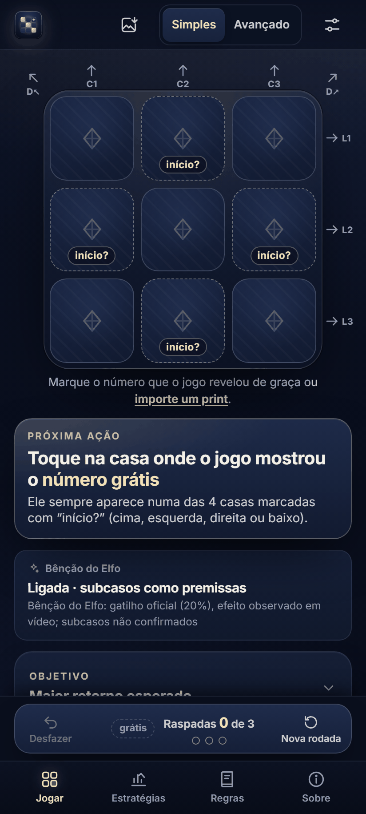
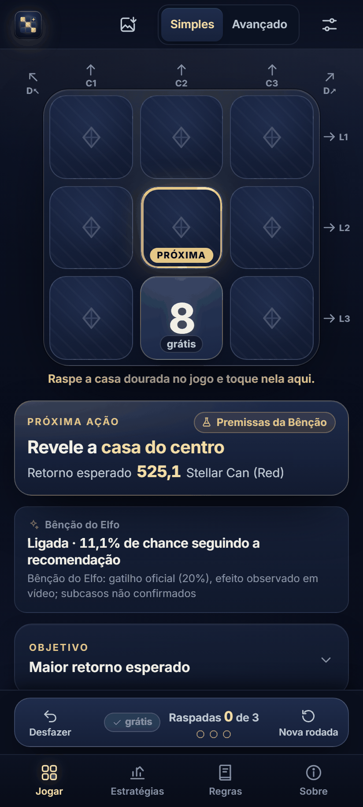
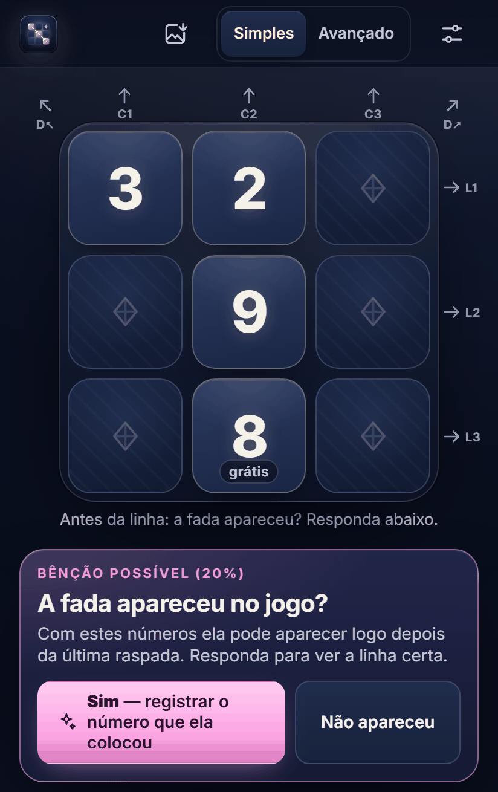
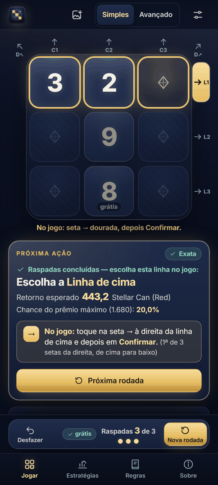

# Carnival Solver

Assistente para a **Raspadinha Comemorativa** do evento **2026 Merry Carnival**
(Idle Heroes). Você informa os números que o jogo mostra, e o app diz **qual casa
raspar** e **qual linha escolher** para ganhar o máximo de latas na média.
Funciona sem internet, não acessa sua conta e não mexe no jogo.

## Baixar

| Onde | Link |
|---|---|
| **Android** (.apk) | [baixar CarnivalSolverUltimate.apk](https://github.com/JacksonBeggi/carnival-solver/releases/latest/download/CarnivalSolverUltimate.apk) |
| **Windows** (instalador) | [baixar CarnivalSolverUltimate-Setup.exe](https://github.com/JacksonBeggi/carnival-solver/releases/latest/download/CarnivalSolverUltimate-Setup.exe) |
| **Windows** (portátil, sem instalar) | [baixar CarnivalSolverUltimate-Portable.exe](https://github.com/JacksonBeggi/carnival-solver/releases/latest/download/CarnivalSolverUltimate-Portable.exe) |
| **Navegador** (abre direto, celular ou PC) | **<https://jacksonbeggi.github.io/carnival-solver/>** |
| **Navegador offline** (um arquivo) | [baixar carnival-solver-offline.html](https://github.com/JacksonBeggi/carnival-solver/releases/latest/download/carnival-solver-offline.html) |

Os links apontam sempre para a versão mais recente. Todas as versões e o
`SHA256SUMS.txt` ficam em [Releases](https://github.com/JacksonBeggi/carnival-solver/releases).

## Instalar

**Android (7 ou mais novo).** Toque no `.apk` baixado. O Android pede para
permitir "Instalar apps desconhecidos" para o navegador ou o app de onde você
abriu o arquivo: permita só para ele. Se o Play Protect avisar que o app não
vem da Play Store, toque em "Instalar mesmo assim". O app **não pede nenhuma
permissão**, nem internet. Versões novas instalam por cima, sem perder nada.

**Windows 10/11.** O `.exe` não tem assinatura digital paga, então o Windows
pode mostrar "O Windows protegeu o seu PC": clique em **Mais informações →
Executar assim mesmo**. A versão portátil abre direto, sem instalar.

Para conferir que o arquivo é o original, compare o SHA-256 com o
`SHA256SUMS.txt` da Release (no PowerShell: `Get-FileHash arquivo`).

## Como usar em 1 minuto

<table>
<tr>
<td align="center" width="25%"></td>
<td align="center" width="25%"></td>
<td align="center" width="25%"></td>
<td align="center" width="25%"></td>
</tr>
<tr>
<td valign="top"><b>1.</b> Abra o app. No jogo, veja em qual casa saiu o número grátis.</td>
<td valign="top"><b>2.</b> Toque a mesma casa no app e escolha o número (aqui, 8 em baixo). O app diz qual casa raspar: <i>Revele a casa do centro</i>.</td>
<td valign="top"><b>3.</b> Depois da última raspada, se a fada puder aparecer, o app pergunta. Responda <b>Sim</b> ou <b>Não apareceu</b>.</td>
<td valign="top"><b>4.</b> A linha certa fica em dourado. No jogo, toque a seta dessa linha e depois em <b>Confirmar</b>.</td>
</tr>
</table>

As imagens são do próprio app (versão de navegador, tela de celular).

## Como usar numa rodada

1. No jogo, toque **Iniciar**. Um número aparece numa das bordas.
2. No app, toque **a mesma casa** e escolha o número.
3. Raspe no jogo a casa que o app destacar e informe o número que saiu. Repita
   até acabarem as 3 tentativas.
4. Se a fada aparecer, registre a casa e o número que ela colocou.
5. Escolha no jogo a linha que o app indicar.

Dica: com dois números de (1,2,3) ou de (7,8,9) na mesma linha, deixe a casa
que fecha essa linha para **a última raspada** — a fada pode completá-la
(1+2+3 = 1.680; 7+8+9 = 1.008).

## Avisos

- Ferramenta independente, feita por jogador. Não é afiliada à desenvolvedora
  do Idle Heroes e não usa imagens nem marcas do jogo.
- O app maximiza a **média** de prêmios em muitas rodadas. Cada rodada continua
  sendo sorte.
- Este repositório contém só os pacotes prontos para download.
